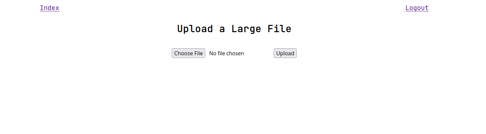

<div align="center">
<h1>Nerd-Storage</h1>
</div>


A simple LAN storage.

## Description

Nerd-Storage is a simple web server for sharing files on the local network.

It supports the download of files and directories, the upload of multiple files at once, making a directory, updates and deletions.

The user can also upload an existing directory as a .zip file which will then be extracted inside the storage as a folder.

## Prerequisites

-   Linux

-   Python 3.6+

## Dependencies

-   [Flask](https://pypi.org/project/Flask/)

-   [Flask-Login](https://pypi.org/project/Flask-Login/)

-   [Jinja2](https://pypi.org/project/Jinja2/)

## Installation

`pip install Nerd-Storage`

## Usage

Run: `nerdstorage`

To access the storage go to: `http://<server-local-ip-addr>:5000/`

To print help information: `nerdstorage --help`

## Configuration

1. Run `hash.py` to set the login password.
2. Edit `config.py` to set the storage path.

This command will output the full path of `hash.py` and `config.py`:

`pip show Nerd-Storage | grep 'Location' | grep -o -E '[/].+' | xargs -I@ printf '@/nerdstorage/hash/hash.py\n@/nerdstorage/config.py\n'`

## Large Files



This feature allows the upload of files of size equal to or greater than the RAM of the machine running Nerd-Storage.

For example if the application is running on a machine with 4GB of RAM to upload a file of size equal to or greater than 4GB this feature has to be used.

Related issue: [github.com/0xHaru/Nerd-Storage/issues/1](https://github.com/0xHaru/Nerd-Storage/issues/1)

### Brief Explanation

The client uses [flow.js](https://github.com/flowjs/flow.js/) to split the file into chunks and send them independently. The server saves each chunk as a separate file, then once all the chunks have been received the server merges them together to recreate the original file.

## CLI

[nerdcli](https://github.com/0xHaru/Nerd-Storage/blob/master/cli/nerdcli.sh) is a command line interface for Nerd-Storage.

Useful link for newbies: [unix.stackexchange.com/questions/storing-shell-scripts](https://unix.stackexchange.com/questions/201768/storing-shell-scripts)

```
usage: nerdcli [--parameter]

--login                         login
--logout                        logout
--ls PATH                       list directory content
--download PATH                 download file or directory
--mkdir PATH                    make a directory
--upload PATH FILE_PATH         upload a file
--upload-dir PATH FILE_PATH     upload a .zip as a directory
--delete PATH                   delete a file or directory

Config:
        Set IP and PORT.
        Script path: /path/to/script

Examples:
        https://github.com/0xHaru/Nerd-Storage/blob/master/cli/examples.md

Project home page: https://github.com/0xHaru/Nerd-Storage
```

## Demo

Release 0.0.9


## License

This project uses the following license: [GPLv3](https://github.com/0xHaru/Nerd-Storage/blob/master/LICENSE).
